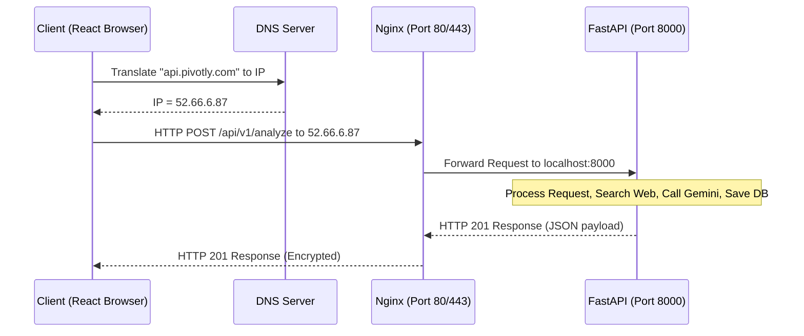

# Pivotly Backend Engineering Learning Guide

Welcome to the **Pivotly Learning Guide**. This handbook is designed for second-year Computer Science students (and developers new to production backend engineering). We teach backend concepts from first principles, using the actual code and design decisions of Pivotly as a live case study.

---

## Introduction

### What is Pivotly?
Pivotly is an evidence-based venture intelligence platform. A user inputs a startup idea, a target region, and a budget range. Pivotly then crawls the web for real-time market data, queries LLMs with strict structured output requirements, and generates a comprehensive, multi-dimensional business feasibility report.

### What Problem Does it Solve?
Normally, evaluating a new business idea takes hours of manual googling, competitor research, and market analysis. Pivotly automates this process, completing it in under 30 seconds while grounding the analysis in factual web-searched context to prevent AI "hallucinations."

### Why is this a Great Backend Project?
Building a production-ready system like Pivotly requires solving real-world distributed systems and reliability problems:
1. **Network I/O management:** Coordinating external search and LLM calls.
2. **Resource contention:** Avoiding database connection pool exhaustion during slow network I/O.
3. **Structured data validation:** Forcing LLMs to return strict JSON shapes and recovering when validation fails.
4. **Production deployment:** Configuring Nginx, Gunicorn, systemd, and environment variables on AWS EC2.

---

## Chapter 1: How the Internet Works

At its core, the internet is just a network of computers sending messages to one another. 

### The Core Terminology
* **Client:** The device or application initiating a request (e.g., your web browser, React app, or a mobile client).
* **Server:** A computer listening for incoming requests, processing them, and returning a response.
* **Request & Response:** The fundamental message pair. The client asks a question (Request); the server answers (Response).
* **HTTP/HTTPS (Hypertext Transfer Protocol Secure):** The standardized rules for formatting web messages. HTTPS encrypts this traffic.
* **DNS (Domain Name System):** The phonebook of the internet. It translates human-friendly domains (e.g., `pivotly.com`) to IP addresses (e.g., `52.66.6.87`).
* **Ports:** Network entry points on a computer. By default, HTTP uses Port 80, HTTPS uses Port 443, and development servers often run on Port 8000.

### The Lifecycle of Clicking "Analyze Idea" in Pivotly
Here is exactly what happens when a user clicks the **"Analyze Idea"** button:



---

## Chapter 2: Frontend and Backend

Modern web applications separate the presentation layer (what the user sees) from the logic and persistence layer (the data and calculations).

* **Frontend:** Built with React, TypeScript, and Vite. It runs inside the user's browser. It is responsible for rendering the UI, managing user input, and making HTTP requests.
* **Backend:** Built with FastAPI (Python). It runs on the server. It handles business logic, security, database access, and external API integrations.
* **API (Application Programming Interface):** The contract defining how the frontend and backend talk to each other.
* **JSON (JavaScript Object Notation):** The text-based format used to exchange data.

### Request-Response Data flow
```
Frontend (React UI)
  │ (1) User types idea and clicks submit
  ▼
API Request (Axios / Fetch) 
  │ (2) POST /api/v1/analyze with JSON body
  ▼
Backend (FastAPI Router)
  │ (3) Authenticates user & checks database rate limits
  ├─► (4) Queries Tavily / DuckDuckGo for live context
  ├─► (5) Sends context to Gemini, requesting structured outputs
  ▼
Database (PostgreSQL)
  │ (6) Saves generated report JSONB structure
  ▼
API Response
  │ (7) Returns 201 Created with {"report_id": "uuid"}
  ▼
Frontend (React UI)
  │ (8) Redirects user to Dashboard and renders report
  ▼
User Views Clean UI Tabs (Strategy, SWOT, Risks, etc.)
```

---

## Chapter 3: REST APIs

REST (Representational State Transfer) is an architectural style for APIs that uses standard HTTP methods to manipulate resources.

### The Four Core HTTP Methods
* **GET:** Retrieve data from the server. (Should have no side effects).
* **POST:** Create new data/resources on the server.
* **PUT/PATCH:** Update existing data on the server.
* **DELETE:** Remove data from the server.

### Pivotly API Design

In Pivotly, we map our actions to standard REST endpoints. Here are the core endpoints used in our application:

* **Authentication:**
  * `POST /auth/register` — Creates a new user account.
  * `POST /auth/login` — Verifies credentials and returns a signed JWT access token.
  * `GET /auth/me` — Fetches current logged-in user profile.
* **Analysis & Reports:**
  * `POST /api/v1/analyze` — Initiates the venture research and LLM report generation pipeline.
  * `GET /api/v1/reports` — Retrieves a paginated list of previous venture reports for the current user.
  * `GET /api/v1/reports/{report_id}` — Retrieves the full detailed JSON analysis report for a specific ID.

> [!NOTE]
> For the complete API request/response JSON schemas, header details, and status codes, refer directly to the [Pivotly API Documentation](docs/API.md).


---

## Chapter 4: FastAPI Fundamentals

FastAPI is a modern, high-performance web framework for building APIs with Python 3.8+ based on standard Python type hints.

### Why FastAPI?
1. **Asynchronous Support:** Built on ASGI, it handles concurrent connections natively using Python's `async/await`.
2. **Pydantic Validation:** Inputs are automatically parsed, validated, and documented using Python types.
3. **Autogenerated Documentation:** Instantly provides Interactive Swagger Docs at `/docs`.

### Processing a Request in FastAPI
In Pivotly, when a request hits `backend/app/api/v1/endpoints/analyze.py`:

```python
@router.post("/analyze", response_model=AnalyzeResponse, status_code=status.HTTP_201_CREATED)
async def analyze_idea(
    payload: AnalyzeRequest,
    current_user: User = Depends(get_current_user),
    report_service: ReportService = Depends(get_rate_limited_report_service),
) -> AnalyzeResponse:
    report = await report_service.analyze_idea(
        idea_text=payload.idea_text,
        user_id=current_user.id,
        region=payload.region,
        budget_range=payload.budget_range
    )
    return AnalyzeResponse(report_id=str(report.id))
```

* **Routing (`@router.post`):** Declares that this function handles HTTP `POST` requests at `/analyze`.
* **Request Parsing (`payload: AnalyzeRequest`):** FastAPI uses Pydantic to parse incoming JSON, throwing a `422 Unprocessable Entity` if the format is incorrect.
* **Dependencies (`Depends()`):** Injects middleware-like components. `Depends(get_current_user)` handles token validation, and `Depends(get_rate_limited_report_service)` returns an initialized instance of our business logic class.

---

## Chapter 5: Authentication Fundamentals

Security in web apps is divided into two phases: **Authentication** (AuthN) — verifying *who* you are, and **Authorization** (AuthZ) — verifying *what* you are allowed to do.

### Password Hashing
Never store plaintext passwords in a database. If a database is compromised, all user accounts are exposed.
* **Solution:** Use a cryptographically secure, slow hashing function (like Bcrypt).
* **Bcrypt Hashing:** Add a random string (the "salt") to the password and hash it thousands of times. Even if two users have the same password, their hashes will look completely different.
* **Verification:** When a user logs in, we hash the submitted password with the stored salt and compare the resulting hash to the database value.

### JSON Web Tokens (JWT)
Once authenticated, the server issues a JWT. It consists of three parts separated by dots:
1. **Header:** Identifies the hashing algorithm (e.g., HS256).
2. **Payload:** Public data (the claims) containing user information (e.g., `user_id`, `expiry`).
3. **Signature:** Generated by combining the encoded header, payload, and a secret key known only to the server.

```
Header.Payload.Signature
```
* **Statelessness:** The server does not need to store active sessions in a database. When a client requests a protected route, they include the token in the `Authorization: Bearer <token>` header. The server verifies the Signature using its secret key. If valid, the server trusts the Payload.

---

## Chapter 6: Database Fundamentals

A Relational Database Management System (RDBMS) stores data in structured tables linked by relationships.

### Pivotly Schema Structure

Pivotly's schema consists of key tables (`users`, `ideas`, `reports`, `rate_limits`) that handle registration, rate-limiting, and report storage.

* **Primary Key (PK):** A unique identifier for each row (e.g., using UUIDs to prevent predictable sequential resource browsing).
* **Foreign Key (FK):** Creates a relationship between tables, linking reports and ideas to their owning user.
* **JSONB DataType:** PostgreSQL supports storing JSON in a parsed binary format. This allows Pivotly to persist complex nested AI reports without forcing expensive migrations whenever the LLM output schema changes.

> [!NOTE]
> For the complete entity-relationship diagram, field specifications, indices, and database configuration, refer directly to the [Pivotly Database Documentation](docs/DATABASE.md).


---

## Chapter 7: SQLAlchemy Fundamentals

### Object Relational Mapping (ORM)
An ORM lets us interact with database tables as Python objects. Instead of writing raw SQL (`SELECT * FROM users`), we write `db.query(User).filter_by(id=user_id).first()`.

### Sessions & Transactions
* **Database Session:** A temporary workspace holding active queries and modifications.
* **Transaction:** A sequence of operations treated as a single, atomic unit of work (all complete, or none do).

### The Connection Pool Starvation Incident
By default, SQLAlchemy creates a **QueuePool** of database connections (default size = 5, overflow limit = 10). Making a connection to a database is computationally expensive, so connections are reused.

#### The Bug
When a user requested an analysis, the request was wrapped in a database session context:
1. Acquire database connection from the pool.
2. Read User profile.
3. *Hold database connection active while sending network requests to Tavily Search API and Gemini AI API (taking 30+ seconds).*
4. Write report back to DB.
5. Commit and release database connection.

If 15 users requested an analysis concurrently, all 15 pool slots became locked waiting on external network APIs. The application froze, and other users could not log in or fetch their dashboards.

#### The Fix
We decoupled the database lifecycle from long network operations:
```python
# 1. Acquire connection quickly for rate limit checks
today = date.today()
current_count = self.rate_limit_repo.get_count(user_id, "idea_submission", today)

# 2. IMMEDIATELY close and release the connection back to the pool
initial_db = self.repository.db
initial_db.close()

# 3. Perform long-running network operations (no database connection locked!)
search_context = await search_venture_context(idea_text)
report = await self.ai_service.generate_report(...)

# 4. Re-acquire a fresh database connection to perform the fast database write
new_db = SessionLocal(expire_on_commit=False)
self.repository.db = new_db

# 5. Persist report and close connection
persisted_report = self.repository.create(...)
new_db.close()
```

---

## Chapter 8: Async Programming

### Synchronous vs. Asynchronous Code
* **Synchronous (Blocking):** Code runs sequentially. If line 2 makes a network request, line 3 cannot execute until line 2 finishes. The CPU sits idle during network waits.
* **Asynchronous (Non-blocking):** A single thread uses an **Event Loop** to coordinate tasks. If a task hits a network wait, it yields control back to the event loop (`await`), allowing the CPU to work on other incoming requests.

```
Sync Execution:
[Request 1: Processing] -> [Request 1: Waiting for AI (30s)] -> [Request 1: Done] -> [Request 2: Processing...]

Async Execution:
[Request 1: Processing] -> [Request 1: Waiting (Yield)] ──┐
                                                          ▼
                                            [Request 2: Processing] -> [Request 2: Waiting (Yield)] -> ...
```

### Async in Pivotly
Pivotly uses `async/await` for all web-bound integrations:
```python
queries = ["comp1", "comp2", "risks"]
# Execute multiple search queries concurrently (in parallel)
results = await asyncio.gather(*[_execute_search(q) for q in queries])
```
Using `asyncio.gather`, Pivotly triggers all 3 search requests at the same time, reducing the search phase duration from 9 seconds down to 3 seconds.

---

## Chapter 9: Search Systems

### Context Grounding (RAG)
Large Language Models (LLMs) are frozen in time; they do not know what happened after their training cut-off date. Asking an LLM to evaluate a new startup idea directly will result in outdated opinions or fake competitor details.
* **Context Grounding:** Pivotly performs real-time queries using the **Tavily Search API** (built for AI agents).
* **The Process:**
  1. The user inputs: "Web3 carbon credit marketplace".
  2. Pivotly searches for:
     * `Web3 carbon credit marketplace competitors pricing features`
     * `Web3 carbon credit marketplace market size TAM CAGR report`
  3. The raw page search snippets are parsed and injected into the LLM system prompt.
  4. The LLM acts as an analyst reading active research, producing an accurate report.
  5. **Fallback:** If Tavily is unavailable, Pivotly automatically routes requests through DuckDuckGo Search (`ddgs`) using an asynchronous executor thread (`asyncio.to_thread`) to ensure the platform never crashes due to search provider downtime.

---

## Chapter 10: Large Language Models (LLMs)

### Core LLM Concepts
* **Tokens:** The basic units of text processed by an LLM (typically ~4 characters).
* **Context Window:** The limit on input and output tokens that an LLM can process in a single invocation.
* **Structured Outputs:** Modern LLM APIs (like Gemini's Structured Outputs) allow developers to supply a JSON schema. The model's token-generation weights are constrained so it can only generate syntactically valid JSON matching that exact schema.

### Real-World Issues Audited in Pivotly
1. **Response Truncation (`MAX_TOKENS`):** Generating detailed reports requires high output tokens. If the limit is set too low (e.g., 2,000 tokens), the JSON stream will cut off mid-response, yielding invalid JSON. In Pivotly, we configured `max_output_tokens=32768` to provide ample headroom.
2. **Schema Over-complexity:** Large nested schemas with dozens of strict limits (e.g., `min_items: 3`, `max_items: 10` on arrays) increase the probability that the LLM fails internal constraints, resulting in generation failures. Simplifying the schema improves performance and dramatically lowers token consumption costs.

---

## Chapter 11: Pydantic Fundamentals

Pydantic is Python's most popular data validation and settings management library.

### Type Safety and Parsing
FastAPI uses Pydantic to enforce data shapes. When the Gemini API returns a JSON payload, Pivotly parses and validates it using a schema:

```python
class VentureReport(BaseModel):
    industry: IndustryAnalysis
    competitors: list[Competitor]  # Must be a list of Competitor objects
    swot: SWOTAnalysis
```

* **Parsing vs. Validation:** Pydantic doesn't just check types; it coerces data. For example, if a field expects an integer but receives `"123"`, Pydantic converts it to `123`.
* **Auto-Repair Pipeline:** To handle LLM variability, Pivotly uses a pre-validation hook to scrub unwanted keys (`title`, `additionalProperties`) generated by SDKs and automatically truncates arrays that exceed Pydantic constraints before validation begins.

---

## Chapter 12: Reliability Engineering

In production, things will fail: networks drop, APIs timeout, and third-party services go down. **Reliability Engineering** is the practice of designing software to handle these failures gracefully.

### 1. Exponential Backoff Retries
When calling Gemini, we wrap the function call using the **Tenacity** library:
```python
@retry(
    stop=stop_after_attempt(3),
    wait=wait_exponential(multiplier=1, min=2, max=10),
    retry=retry_if_exception_type(APIError)
)
async def generate_with_retry(...):
    ...
```
If the API returns a rate-limit error, the app waits 2 seconds, then 4 seconds, then 8 seconds before giving up. This protects the system from transient network spikes.

### 2. Timeouts
Never let a network request wait indefinitely. If a service hangs, your application threads will freeze. We configure HTTP clients with explicit timeouts (e.g., 15s for Tavily, 30s for Gemini).

### 3. Database Rate Limiting
To prevent single users from exhaustively consuming API budget, a sliding-window rate limit checks user request counts directly in PostgreSQL before making calls to external services.

---

## Chapter 13: Production Deployments

### The Production Stack
FastAPI is a Python application; it is not suited to handle raw public traffic directly. For production deployments (e.g., on AWS EC2), we use a layered stack:

```
Public Internet (HTTPS)
       │
       ▼
Nginx (Reverse Proxy & Port Forwarding)
       │ (Forwards to localhost:8000)
       ▼
Gunicorn (Process Manager / Master Process)
       │ (Manages Worker Processes)
       ▼
Uvicorn Workers (ASGI Web Servers running FastAPI)
```

1. **Nginx (Reverse Proxy):** Listens on the public ports (80/443). It acts as a shield, handling SSL encryption/decryption, serving static frontend files (React build artifacts), and forwarding API traffic to the backend.
2. **Gunicorn (Process Manager):** A WSGI HTTP server that manages Uvicorn worker instances. If a worker process crashes due to a memory leak or error, Gunicorn instantly spins up a replacement process.
3. **Uvicorn (ASGI Server):** The server that directly executes Python's async FastAPI code.

---

## Chapter 14: Observability and Debugging

Observability is the ability to measure the internal states of a system by examining its outputs (logs, metrics, and traces).

### Production Incidents & Diagnostics

#### Incident 1: Connection pool timeout
* **Symptom:** Logs showed `TimeoutError: QueuePool limit of size 5 overflow 10 reached, connection timed out`.
* **Diagnostic Path:** Searched logs for API request durations. Noticed `/analyze` requests took 35 seconds, and database connection metrics showed all connections occupied during this time.
* **Resolution:** Implemented the disconnect-reconnect lifecycle to release pool connections during network waits.

#### Incident 2: SQLAlchemy `DetachedInstanceError`
* **Symptom:** `DetachedInstanceError: Parent instance <Report> is not bound to a Session; attribute refresh operation cannot proceed`.
* **Diagnostic Path:** Traced the error to the JSON response serialization step. The database session was closed *before* FastAPI could serialize the database object to JSON.
* **Resolution:** Used `expire_on_commit=False` and `db.expunge(report)` to decouple the returned database object from the transaction cycle.

---

## Chapter 15: Software Architecture

Pivotly uses a **layered architecture** to separate concerns:

```
Route (API Endpoint)
     │ (Handles HTTP Requests/Responses & DTO Validation)
     ▼
Service Layer (Orchestrator)
     │ (Coordinates Business Logic: Search + AI + Storage)
     ▼
Repository Layer (Data Access)
     │ (Executes SQL queries via SQLAlchemy ORM)
     ▼
Database (PostgreSQL)
```

### Why Use Layers?
1. **Maintainability:** If we change our database schema or swap out PostgreSQL for MongoDB, we only change the Repository layer. The Service and Route layers remain untouched.
2. **Testability:** We can test the Service layer by mock-injecting a fake repository, avoiding the need to spin up a real database during unit tests.

---

## Chapter 16: Engineering Lessons Learned

1. **Always release resources before slow network operations:** Database connection starvation was our biggest system bottleneck. Decoupling network waits from database sessions is a mandatory best practice for AI-agent backends.
2. **Never trust AI output structure without schema fallback controls:** Structured output schemas are highly reliable, but they fail under extreme lengths or subtle model fluctuations. A custom sanitization layer (pre-parsing/cleaning) is vital to avoid 502 validation failures.
3. **Draft complete deployment configurations early:** Using incorrect variable names (like `VITE_API_URL` instead of `VITE_API_BASE_URL`) or missing credentials (`TAVILY_API_KEY`) in production files can cause hidden failures that do not show up during local developer runs.

---

## Chapter 17: Interview Preparation

### FastAPI
* **Q:** What is the difference between `def` and `async def` in FastAPI?
* **A:** `async def` runs on the main execution event loop and yields control when awaiting I/O. Standard `def` endpoints are executed on a separate thread pool to prevent blocking the main loop.
* **Pivotly Example:** Pivotly uses `async def` for `/analyze` because it waits for search and Gemini requests, letting other requests execute in the background.

### PostgreSQL
* **Q:** What is the advantage of using a `JSONB` column over a standard text column for JSON storage?
* **A:** `JSONB` decomposes the JSON data into a binary format, allowing faster lookup, supporting indexing on individual JSON keys, and parsing data faster than regular text columns.

### SQLAlchemy
* **Q:** What is connection pool starvation, and how do you prevent it?
* **A:** It occurs when all pool connections are occupied by long-running operations. Prevent it by keeping transactions as short as possible and releasing connections before launching slow network I/O.

---

## Roadmap: Learning Backend Engineering

```
    BEGINNER
      │  • Learn HTTP/HTTPS concepts & REST APIs
      │  • Build simple CRUD APIs with FastAPI & SQLite
      │  • Understand basic database design (Tables, PK, FK)
      ▼
   INTERMEDIATE
      │  • Implement Authentication (JWT, Bcrypt hashing)
      │  • Learn Async programming (async/await, event loops)
      │  • Work with SQLAlchemy ORMs and manage migration versions (Alembic)
      │  • Write unit tests & integration scripts
      ▼
    ADVANCED
         • Master Connection Pooling & Resource Lifecycle management
         • Implement task queues (Celery + Redis) for background workers
         • Deploy apps on Cloud (AWS EC2, Nginx, Gunicorn, systemd)
         • Implement structural observability (structured logging, tracing metrics)
```
