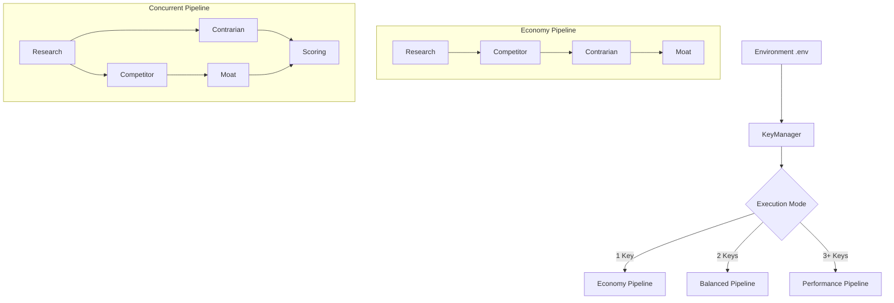

# Adaptive Gemini Pipeline

Pivotly implements an adaptive execution pipeline that dynamically adjusts its behavior based on the number of configured Gemini API keys. This ensures the system runs optimally under various resource constraints, maximizing concurrency when keys are plentiful and minimizing rate limits when keys are scarce.

## Execution Modes

The system automatically detects the number of keys in the `.env` file and assigns an execution mode:

### 1. ECONOMY MODE (1 Key)
- **Condition**: Only `GEMINI_API_KEY_1` (or legacy `GEMINI_API_KEY`) is configured.
- **Goals**: Minimum Gemini API requests, minimum RPM usage, lowest chance of hitting quota.
- **Pipeline**: Sequential Execution.
  `Research -> Competitor -> Contrarian -> Moat -> Scoring (Python) -> Action`

### 2. BALANCED MODE (2 Keys)
- **Condition**: `GEMINI_API_KEY_1` and `GEMINI_API_KEY_2` are configured.
- **Goals**: Moderate concurrency, better latency, safe RPM usage.
- **Pipeline**: Concurrent Execution (2 parallel tasks).
  ```
  Research -> [Competitor || Contrarian] -> Moat -> Scoring -> Action
  ```

### 3. PERFORMANCE MODE (3+ Keys)
- **Condition**: 3 or more keys are configured.
- **Goals**: Maximum throughput, lowest latency, utilize all available Gemini keys.
- **Pipeline**: Concurrent Execution.
  ```
  Research -> [Competitor || Contrarian] -> Moat -> Scoring -> Action
  ```

## Architecture



## Adaptive Orchestration

The `ReportService` reads the current execution mode from the `KeyManager`. If `ECONOMY` mode is detected, the agents run strictly sequentially. If `BALANCED` or `PERFORMANCE` mode is detected, `Competitor` and `Contrarian` run concurrently using `asyncio.gather`, while `Moat` runs after `Competitor` completes (as it depends on Competitor outputs).

## Key Lifecycle and Rate Limit Resilience

Instead of hardcoding specific agents to specific keys, Pivotly utilizes a robust, non-blocking resource pool via `KeyManager` and `GeminiScheduler`.

1. **Startup Validation**: On boot, the `KeyManager` tests all configured keys with a lightweight prompt. Invalid keys are disabled, and rate-limited keys are put on cooldown immediately.
2. **Non-blocking Acquire**: The `GeminiScheduler` requests an available key using `try_acquire_key`.
3. **Execution & Metrics**: The API request is executed. The `KeyManager` tracks success/failure rates and average latency per key.
4. **Resilient Cooldowns (WAITING_FOR_API)**: 
   - If a `429 Too Many Requests` occurs, the key is placed on a 60-second cooldown.
   - If **all** keys are in use or on cooldown, a `NoAvailableGeminiKey` exception is raised.
   - The `ReportService` catches this, transitions the report to the `WAITING_FOR_API` state (preserving the frontend's ability to poll the exact status), and gracefully suspends the worker via an asynchronous sleep loop until a key frees up.
   - This ensures background jobs never fail permanently due to transient rate limits.

## Telemetry and Health Monitoring

The KeyManager exposes live telemetry through the application's `/api/v1/health` and `/api/v1/health/metrics` endpoints. These provide real-time visibility into:
- The total number of configured and healthy keys.
- Active cooldown states.
- The currently active Execution Mode.
- Per-key metrics including success rates and average response latencies.
