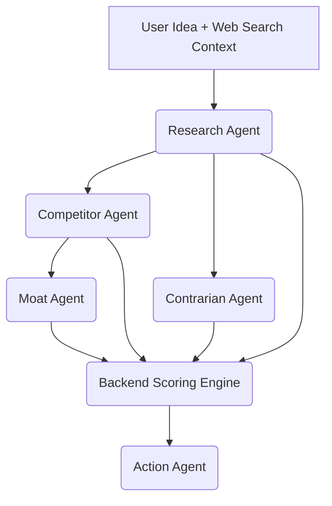

# AI Pipeline Architecture: Venture Intelligence Platform

## AI Pipeline Overview

The Pivotly application features a production-grade, Directed Acyclic Graph (DAG) Artificial Intelligence pipeline designed to evaluate raw startup ideas and output highly structured, multi-dimensional venture reports. It relies on a "RAG-lite" (Retrieval-Augmented Generation) approach using live web search to ground the AI's knowledge, native API structured outputs, and automatic validation/repair hooks to guarantee reliability and format consistency.

## Flow Diagram



## Input Processing

When a user submits an analysis request, the backend receives the `idea_text`, `region`, and `budget_range`.
Before the AI is invoked, the `ReportService` calls the `SearchService` (`search_competitors`). The system executes search queries:
1. **Primary**: Queries the **Tavily Search API** to get live, relevant competitor and market context.
2. **Fallback**: Falls back to DuckDuckGo Search (`ddgs`).

The gathered results (titles, URLs, and snippets) are compiled into a markdown-formatted context string (`search_context`). This serves as the "live web grounding" for the LLM, reducing hallucinated competitor analysis.

---

## Agent Personas & Schemas

### Reusable Primitive: `Evidence`
Every major qualitative claim generated by an agent MUST be supported by an `Evidence` object.
```python
class Evidence(BaseModel):
    claim: str = Field(description="The factual claim being made")
    source_url: str | None = Field(description="URL to the source backing this claim")
    quote: str | None = Field(description="Direct quote or specific data point from the source")
    confidence: str = Field(description="High, Medium, or Low")
```

### 1. Research Agent
**Persona:** Objective Market Data Researcher
**Input:** Idea Text, Raw Tavily Search Results
**Goal:** Extract pure factual data. Do not generate opinions.
```python
class ResearchContext(BaseModel):
    market_size_estimate: str
    growth_rate_estimate: str
    target_audience: list[str]
    identified_competitors: list[str]
    regulatory_concerns: list[str]
    evidence_list: list[Evidence]
```

### 2. Competitor Agent
**Persona:** Cutthroat Competitive Intelligence Analyst
**Input:** Idea Text, `search_context`, `ResearchContext`
**Goal:** Determine how competitors will destroy the startup. Explicitly cite sources from the `search_context`.
```python
class Competitor(BaseModel):
    name: str
    website: str | None
    threat_level: str
    copy_risk: str
    strengths: list[str]
    weaknesses: list[str]

class CompetitorAnalysis(BaseModel):
    competitors: list[Competitor]
    market_concentration: str
    evidence_list: list[Evidence]
```

### 3. Contrarian Agent
**Persona:** Skeptical Sequoia Capital Partner
**Input:** Idea Text, `search_context`, `ResearchContext`
**Goal:** Find reasons to say "No" to the investment.
```python
class ContrarianAnalysis(BaseModel):
    top_failure_reasons: list[str]
    critical_assumptions: list[str]
    largest_unknowns: list[str]
    execution_risks: list[str]
```

### 4. Moat Agent
**Persona:** Strategic Defensibility Expert
**Input:** Idea Text, `search_context`, `CompetitorAnalysis`
**Goal:** Identify any defensible moats.
```python
class MoatAnalysis(BaseModel):
    moat_type: str
    defensibility_explanation: str
    copy_difficulty: str
    network_effects_present: bool
    data_advantage_present: bool
    evidence_list: list[Evidence]
```

### 5. Action Agent
**Persona:** Serial Startup Founder / Execution Expert
**Input:** Idea Text, `Scoring`, All previous JSONs
**Goal:** Produce a GTM Strategy and actionable next steps.
*(Outputs `ActionPlan`)*

---

## Token Optimization & Hallucination Strategy
By passing the `search_context` redundantly downstream, we consume approximately 9,500 input tokens. However, this is considered a highly worthwhile tradeoff because it strictly limits the agents to exclusively citing `source_url` from provided data, permanently eliminating URL hallucination.

---

## Deterministic Scoring Engine

In V1, Pivotly relied on the LLM to generate scores. In V2, a backend Python service (`scoring_service.py`) applies a deterministic algorithm to generate the final scorecard based on the LLM classifications.

### Category Scoring Logic (0-10)

#### A. Market Score
- **Base Score (5/10)**
- **Market Size Modifiers:** `> $1B TAM`: +2, `$100M - $1B TAM`: +1, `< $100M TAM`: -1
- **Growth Modifiers:** `High Growth`: +2, `Moderate Growth`: +1, `Stagnant/Declining`: -2
- **Evidence Penalty:** Empty `evidence_list`: -3

#### B. Competition Score
- **Base Score (10/10)** (Lower is worse for the startup)
- **Competitor Count Modifiers:** `0-1`: 0, `2-4`: -2, `5+`: -4
- **Concentration Modifiers:** `Monopoly`: -3, `Consolidated`: -2, `Fragmented`: +1
- **Threat Level Modifiers:** Subtract 1 for every competitor marked with `High` threat.

#### C. Moat Score
- **Base Score (0/10)**
- **Moat Type:** `Network Effects`: +4, `Data Advantage`: +3, `High Switching Costs`: +3, `Brand`: +2
- **Copy Difficulty:** `High`: +3, `Medium`: +1, `Low`: 0

#### D. Execution Risk Score
- **Base Score (10/10)**
- **Risk Deductions:** Subtract 1.5 for `top_failure_reasons` (up to -6). Subtract 1 for `critical_assumptions` (up to -4).
- **Regulatory Penalty:** Subtract 2 if concerns exist.

### Overall Score Calculation (0-100)
The overall score is a weighted average:
- Market: 20%
- Competition: 25%
- Moat: 35%
- Execution Risk: 20%

---

## Gemini Integration & Fault Tolerance

The AI interaction is handled by the `AIService` class using the `google-genai` Python SDK (`gemini-2.5-flash`).

1. **Schema Validation**: The API response is parsed and validated using Pydantic `model_validate_json()`.
2. **Auto-Repair Engine**: If validation fails due to minor schema discrepancies, a fallback sanitization loop coerces array lengths and attributes.
3. **Partial Failure Recovery (`SectionError`)**: If an individual agent entirely fails validation or API limits, the pipeline gracefully catches the exception, returns a `SectionError(status="UNAVAILABLE")` for that specific section, and allows the remaining agents to continue generating the report. This prevents single-node failures from crashing the entire DAG.
