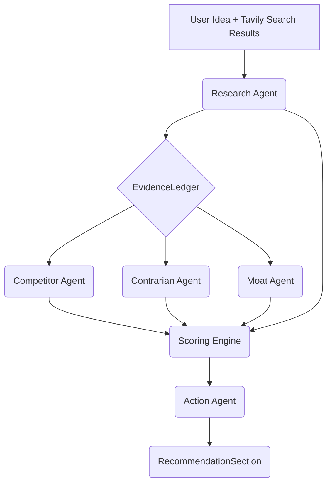

# AI Pipeline Architecture: Venture Intelligence Platform

## AI Pipeline Overview

The Pivotly application features a production-grade, Directed Acyclic Graph (DAG) Artificial Intelligence pipeline designed to evaluate raw startup ideas and output highly structured, multi-dimensional venture reports. It relies on a "RAG-lite" (Retrieval-Augmented Generation) approach using live web search to ground the AI's knowledge, native API structured outputs, and automatic validation/repair hooks to guarantee reliability and format consistency.

## Flow Diagram



## Input Processing

When a user submits an analysis request, the backend receives the `idea_text`, `region`, and `budget_range`.
Before the AI is invoked, the `ReportService` calls the `SearchService` (`search_competitors`). The system executes search queries:
1. **Primary**: Queries the **Tavily Search API** to get live, relevant competitor and market context.
2. **Fallback**: Falls back to DuckDuckGo Search (`ddgs`).

The gathered results (titles, URLs, and snippets) are compiled into a markdown-formatted context string (`search_context`). This serves as the "live web grounding" for the LLM, reducing hallucinated competitor analysis.

---

## Agent Personas & Schemas

### Reusable Primitive: `Evidence`
Every major qualitative claim generated by an agent MUST be supported by an `Evidence` object.
```python
class Evidence(BaseModel):
    claim: str             # The factual claim being made
    source_url: str | None # URL to the source backing this claim
    reliability: str       # "High", "Medium", or "Low"
```

### 1. Research Agent
**Persona:** Objective Market Data Researcher  
**Input:** Idea Text, Raw Tavily Search Results  
**Goal:** Extract pure factual data. Do not generate opinions.
```python
class ResearchContext(BaseModel):
    market_overview: str
    target_demographics: list[str]
    market_size_indicators: list[Evidence]
    key_trends: list[str]
```

### 2. Competitor Agent
**Persona:** Cutthroat Competitive Intelligence Analyst  
**Input:** Idea Text, `EvidenceLedger`  
**Goal:** Determine how competitors will destroy the startup. Cite sources from the ledger.
```python
class V2CompetitorItem(BaseModel):
    name: str
    website: str | None
    threat_level: str      # "High", "Medium", "Low"
    copy_risk: str         # "High", "Medium", "Low"
    differentiator_weakness: str
    evidence_list: list[Evidence]

class CompetitorAnalysis(BaseModel):
    competitors: list[V2CompetitorItem]
    market_saturation: str  # "High", "Medium", "Low"
    summary: str
```

### 3. Contrarian Agent
**Persona:** Skeptical Sequoia Capital Partner  
**Input:** Idea Text, `EvidenceLedger`  
**Goal:** Find reasons to say "No" to the investment.
```python
class ContrarianAnalysis(BaseModel):
    critical_assumptions: list[str]
    why_it_might_fail: list[str]
    hidden_risks: list[str]
    evidence_list: list[Evidence]
```

### 4. Moat Agent
**Persona:** Strategic Defensibility Expert  
**Input:** Idea Text, `EvidenceLedger`, `CompetitorAnalysis` JSON  
**Goal:** Identify any defensible moats.
```python
class MoatAnalysis(BaseModel):
    network_effects: str | None
    switching_costs: str | None
    brand_power: str | None
    overall_defensibility: str  # "High", "Medium", "Low"
    evidence_list: list[Evidence]
```

### 5. Action Agent
**Persona:** Serial Startup Founder / Execution Expert  
**Input:** Idea Text, `ScoringRubricSection` JSON  
**Goal:** Produce a GTM strategy and actionable next steps.
```python
class ActionPlan(BaseModel):
    go_to_market_phases: list[str]
    unit_economics_cac: str | None
    unit_economics_ltv: str | None
    unit_economics_payback: str | None
    next_steps: list[NextStepItem]
    founder_recommendation: str
```

---

## EvidenceLedger & Token Optimization

The `EvidenceLedger` is a typed context object built after the Research Agent completes. It replaces the raw `search_context` string that was previously injected redundantly into every downstream agent.

```python
class EvidenceLedger(BaseModel):
    market_indicators: list[Evidence]      # from ResearchContext.market_size_indicators
    competitor_references: list[str]       # domain names extracted from search URLs
    citations: list[Evidence]              # sourced from market_size_indicators
    risk_signals: list[str]               # seeded by Contrarian in future phases
    trend_signals: list[str]              # from ResearchContext.key_trends
    available_source_urls: list[str]       # deduplicated URLs from raw search (cap 20)
    raw_search_context: str               # fallback if Research Agent fails

    def to_prompt_block(self) -> str:
        """Renders a compact, structured markdown block for agent prompts."""
        ...
```

**Benefits:**
- Downstream agents receive structured facts — not a wall of raw search snippets.
- Token reduction: ~5,000-char raw search → ~470-char ledger block per agent prompt (~10× compression).
- Fallback path: if Research Agent fails (`SectionError`), a minimal ledger with just `raw_search_context` is used.

### Skills Architecture

Agent prompts are stored as external Markdown files in `backend/app/skills/`, loaded at runtime by `AIService`:

| Skill File | Agent | Key Directive |
|---|---|---|
| `research_skill.md` | Research Agent | Extract facts only; no opinions |
| `competitor_skill.md` | Competitor Agent | Cite sources from EvidenceLedger |
| `moat_skill.md` | Moat Agent | Identify defensible moats |
| `contrarian_skill.md` | Contrarian Agent | Find reasons to say "No" |
| `action_skill.md` | Action Agent | Produce GTM strategy from scoring |

This separates prompt engineering from Python code — prompts can be iterated without touching service logic.

---

## Deterministic Scoring Engine

In V1, Pivotly relied on the LLM to generate scores. In V2, a backend Python service (`scoring_service.py`) applies a deterministic algorithm to generate the final scorecard based on the agent outputs.

### Category Scoring Logic (0-10)

#### A. Market Size Score
- **Base Score (5/10)**
- Modifier: `+1` per `Evidence` item in `research_context.market_size_indicators` (capped at 10)

#### B. Competitive Advantage Score
- **Base Score (5/10)**
- `moat.overall_defensibility == "High"` → 9
- `moat.overall_defensibility == "Medium"` → 6
- `moat.overall_defensibility == "Low"` → 3

#### C. Technical Feasibility Score
- **Base Score (7/10)**
- Deducts 1 per `hidden_risk` in `contrarian_analysis` (floor: 1)

#### D. Monetization Potential Score
- **Base Score (6/10)**
- `competitors.market_saturation == "Low"` → +2
- `competitors.market_saturation == "High"` → -2

#### E. Founder Fit Score
- **Fixed Baseline (5/10)** — deterministic baseline (no founder data available)

### Overall Score Calculation (0-100)
Weighted sum of the five category scores:

| Category | Weight |
|---|---|
| Market Size | ×2.5 |
| Competitive Advantage | ×3.0 |
| Technical Feasibility | ×1.5 |
| Monetization Potential | ×2.0 |
| Founder Fit | ×1.0 |

All section errors produce default baseline scores so the engine always returns a non-null `ScoringRubricSection`.

---

## Gemini Integration & Fault Tolerance

The AI interaction is handled by the `AIService` class using the `google-genai` Python SDK (`gemini-2.5-flash`).

1. **Schema Validation**: The API response is parsed and validated using Pydantic `model_validate_json()`.
2. **Auto-Repair Engine**: If validation fails due to minor schema discrepancies, a fallback sanitization loop coerces array lengths and attributes.
3. **Partial Failure Recovery (`SectionError`)**: If an individual agent entirely fails validation or API limits, the pipeline gracefully catches the exception, returns a `SectionError(status="UNAVAILABLE")` for that specific section, and allows the remaining agents to continue generating the report. This prevents single-node failures from crashing the entire DAG.
