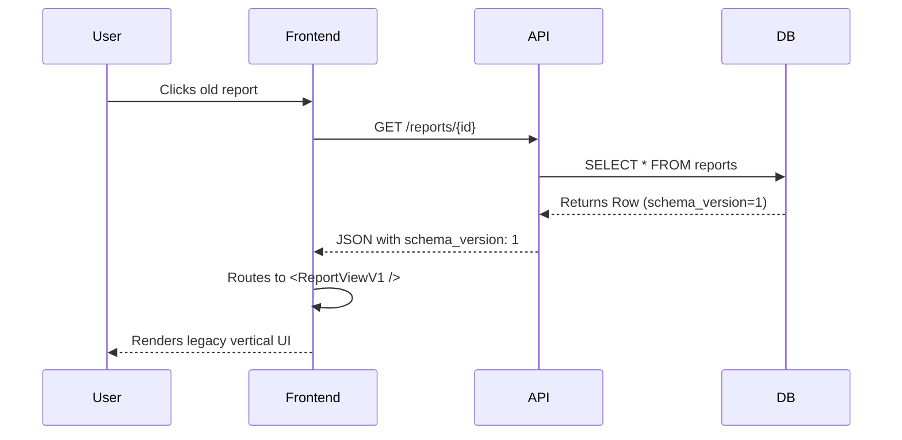
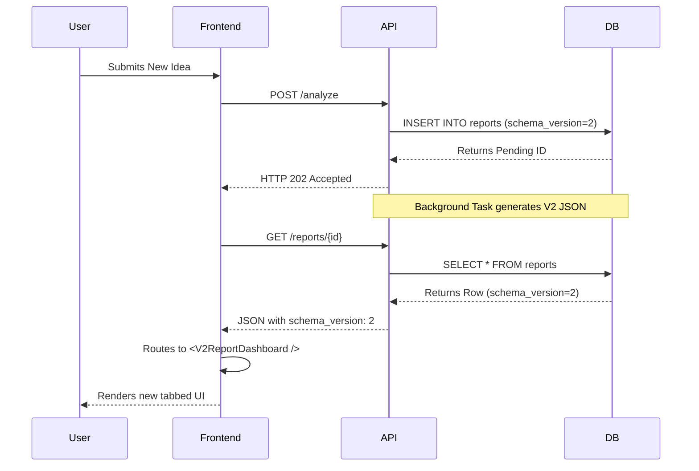
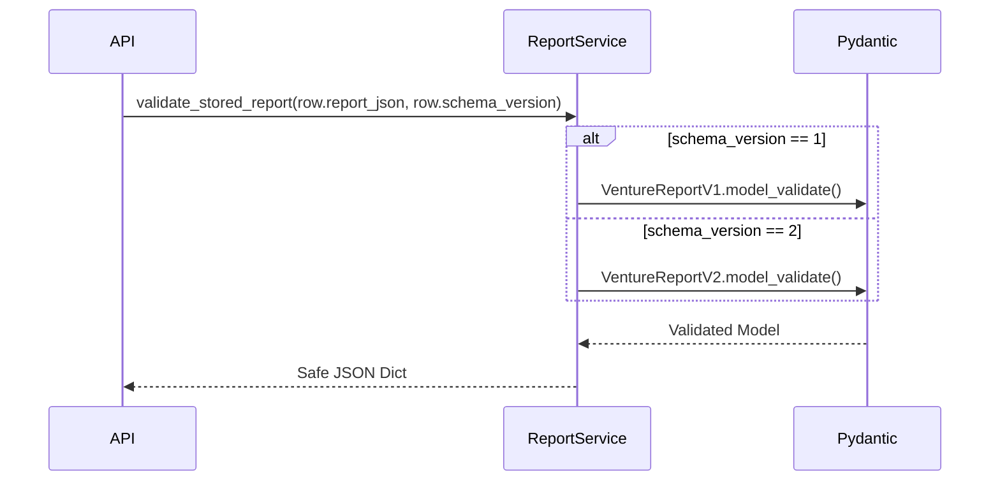

# Pivotly V2: Phase 1 Implementation Design

## Overview
This document outlines the detailed implementation strategy for **Phase 1: Foundation & Data Modeling**. The primary goal is to safely introduce the V2 data structures into the PostgreSQL database, Pydantic layers, and Frontend models without breaking the existing V1 report generation, retrieval, rendering, or PDF export pipelines.

---

## 1. Schema Version Support & Database Changes

### Exact Files Modified
- `backend/app/models/report.py`
- `backend/alembic/versions/*_add_schema_version.py` (New)

### Models/Schemas Affected
- `Report` SQLAlchemy Model

### Database Migration Details
We will add a new column `schema_version` to the `reports` table.
- **Type:** `Integer`
- **Nullable:** `False`
- **Server Default:** `1`

This ensures that all existing reports in the database automatically inherit a `schema_version` of `1` without requiring a massive data update script. 

### Backward Compatibility Impact
**Zero impact.** Legacy reports will seamlessly act as V1 reports. Future reports will explicitly insert `schema_version=2`.

### Rollback Strategy
Revert the Alembic migration (drop column `schema_version`). The application will continue functioning as long as the ORM is rolled back concurrently.

---

## 2. VentureReportV1 vs VentureReportV2 Coexistence

### Exact Files Modified
- `backend/app/schemas/report.py` (Rename current model)
- `backend/app/schemas/report_v2.py` (New file)
- `backend/app/schemas/evidence.py` (New file)

### Pydantic Schema Changes
1. Rename the existing `VentureReport` to `VentureReportV1` to preserve it strictly for legacy decoding.
2. Create `VentureReportV2` containing the flattened structure (`ResearchContext`, `CompetitorAnalysis`, `MoatAnalysis`, `Scorecard`).
3. Ensure `VentureReportV2` components utilize the new `Evidence` schema for citations.

### Service Layer Changes
In `backend/app/services/report_service.py`, the `validate_stored_report` method currently assumes V1. It will be refactored to act as a factory:

```python
# Pseudo-logic
def validate_stored_report(report_json: dict, schema_version: int):
    if schema_version == 1:
        return VentureReportV1.model_validate(report_json)
    return VentureReportV2.model_validate(report_json)
```

### Rollback Strategy
Delete `report_v2.py` and rename `VentureReportV1` back to `VentureReport`.

---

## 3. Existing Report Retrieval Endpoints

### Exact Files Modified
- `backend/app/schemas/report.py` (Response schemas)
- `backend/app/api/v1/endpoints/reports.py`

### API Compatibility Impact
Currently, `GET /api/v1/reports/{id}` returns a Pydantic object containing `report_json`. 
Because JSON is dynamically structured, the API contract *itself* does not break, provided the frontend knows how to parse the JSON. 
However, the top-level API response schema (`ReportResponse`) must be updated to include the new `schema_version` field so the frontend client can perform routing.

### Testing Strategy
Create a test database with existing V1 reports. Execute `GET /reports/{id}` and assert that `schema_version` equals `1` and `report_json` parses successfully as `VentureReportV1`.

---

## 4. Frontend Rendering & PDF Pipeline Coexistence

### Exact Files Modified
- `frontend/src/types/report.ts`
- `frontend/src/pages/ReportPage.tsx`
- `frontend/src/components/report/ReportViewV1.tsx` (Renamed from current view)

### Frontend Compatibility Impact
The frontend currently assumes `report_json` strictly matches the V1 shape. 
If we feed it V2 JSON, it will crash due to missing keys (e.g., trying to map over the V1 `swot` array).

**Implementation Design:**
1. Extract the entirety of the current `ReportPage` rendering logic into a component named `<ReportViewV1 report={data} />`.
2. Update `ReportPage.tsx` to act as a router:
```tsx
// Pseudo-logic
if (report.schema_version === 1) {
    return <ReportViewV1 report={report.report_json} />;
} else {
    // Return empty placeholder for now until Phase 4 builds the V2 UI
    return <V2Placeholder />; 
}
```

### PDF Generation Pipeline Impact
The PDF export relies on CSS `@media print` queries reading the DOM. 
Because `<ReportViewV1 />` is functionally identical to the current DOM structure, the PDF export for V1 reports will remain 100% intact. V2 PDF generation will be handled natively when the V2 UI is built in Phase 4.

---

## 5. Sequence Diagrams

### V1 Report Lifecycle (Current / Legacy)


### V2 Report Lifecycle (Future)


### Mixed-Version Report Retrieval (Factory Pattern)


---

## 6. Migration Plans

### Existing Stored Reports (V1)
- **Data Migration:** None required. The database schema update sets `server_default=1`.
- **Logic:** The backend and frontend will inherently treat any report without a version, or with version 1, as legacy.
- **UI:** Rendered using the frozen `<ReportViewV1 />` component.

### Newly Generated Reports (V2 Readiness)
During Phase 1, the pipeline will *continue* to generate V1 reports because the Multi-Agent pipeline (Phase 2 & 3) is not built yet.
- `schema_version` will be explicitly passed as `1` in `create_pending_report()` to maintain stability during the transition.
- Only once Phase 3 is merged will the backend flip the switch to insert `schema_version = 2`.

### Version Detection Logic
Detection will rely on the `schema_version` integer in the root of the database row (not inside the JSONB payload). This prevents needing to deserialize massive JSON payloads just to determine how to route the request or parse the object.
