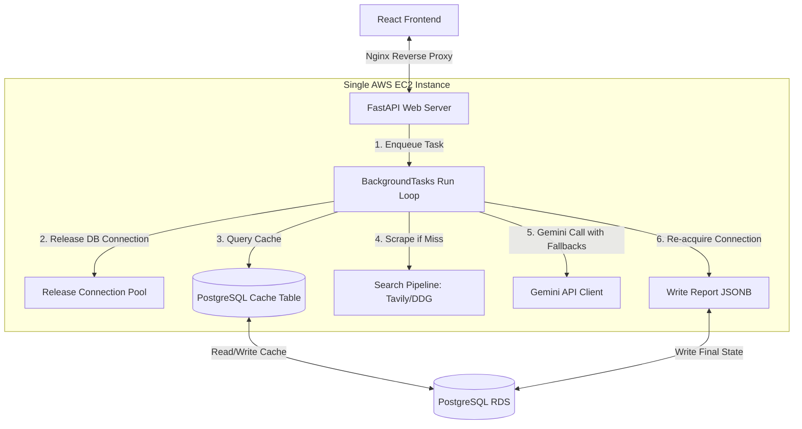

# Pivotly Zero-Cost V2 Architecture Roadmap
## CTO-Level Systems Review, Risk Matrix, and Pragmatic Scale Blueprint (Zero AWS Cost)

---

## 1. Executive Summary

This document outlines the **Zero-AWS-Cost V2 Roadmap** for the Pivotly Venture Intelligence Platform. The primary objective is to maximize performance, reliability, and concurrency while maintaining a **$0 budget increase** on AWS infrastructure. 

To achieve this, we **exclude** distributed tools like Redis, Celery, ElastiCache, ALB, and multi-node EC2 clusters. Instead, we optimize the application to run entirely on the existing **single EC2 instance** and **RDS PostgreSQL database**.

### Key Architectural Shifts
1.  **FastAPI BackgroundTasks**: Replace the proposed Celery system with FastAPI’s native `BackgroundTasks`. Tasks run asynchronously within the existing Gunicorn/Uvicorn process, eliminating worker daemons and broker overhead.
2.  **PostgreSQL-Backed Caching**: Replace the proposed Redis cache with a lightweight `search_cache` table in PostgreSQL. This stores search context across workers and restarts at **$0 monthly cost** with no new server processes.
3.  **Client-Side Status Polling**: Use lightweight HTTP polling on a dedicated status table rather than stateful WebSockets or Server-Sent Events, minimizing server connection overhead.
4.  **Database Query Optimization**: Defer heavy `JSONB` report column loading in user dashboard list queries to reduce memory footprint and database query times.

---

## 2. Component Analysis (Cost, Complexity & Benefit)

The table below breaks down every proposed V2 component under this cost-minimized framework.

| Component | Architecture Strategy | Monthly Cost Impact | Operational Complexity | Expected Benefit |
| :--- | :--- | :--- | :--- | :--- |
| **FastAPI BackgroundTasks** | Native in-process async worker queue running within the existing FastAPI web process. | **$0** (Uses existing CPU/RAM idle capacity) | **Very Low** (Standard FastAPI feature, no process supervisors) | **High**: Eliminates browser HTTP timeouts by returning a `202 Accepted` status immediately. |
| **PostgreSQL Search Cache** | A standard relational database table (`search_cache`) to store Tavily/DDG search responses mapped by a hash of the query. | **$0** (Uses existing PostgreSQL storage; metadata is minimal) | **Very Low** (Simple SQLAlchemy model & Alembic migration) | **High**: Cuts search API latencies by 80% on repeated queries and prevents DDG scraper rate blocking. |
| **List-Based Key Rotation** | Simple list-based exception-handling rotation inside `ai_service.py` that switches keys upon hitting a `429` error. | **$0** (Uses standard free-tier keys) | **Very Low** (No external key management or cooldown state stores) | **High**: Bypasses the 20 request/day Gemini free tier limit safely. |
| **Polling Endpoint** | API endpoint `/api/v1/reports/{id}/status` querying a simple integer status code in the database. | **$0** (Standard HTTP endpoint) | **Very Low** (Simple database lookups) | **High**: Client knows generation progress; resilient to client network disconnects. |
| **Deferred Column Loading** | Defer loading of the heavy `report_json` field during report dashboard listings. | **$0** (Code configuration change) | **Very Low** (Uses standard SQLAlchemy `.options(defer())` helper) | **High**: Drastically reduces server memory consumption and database query response times. |

---

## 3. Review of the Original V2 Plan

Based on our cost-minimization mandate, we have adjusted the original V2 plan decisions:

*   **Celery**: **REMOVE**. Running Celery workers and message brokers (like RabbitMQ or Redis) requires managing separate worker processes and consumes excessive memory on the single `t3.micro` instance. Instead, native `BackgroundTasks` will handle execution.
*   **Redis**: **REMOVE**. Caching and rate limiting will be handled directly in PostgreSQL or local in-process caches, eliminating Redis setup, monitoring, and storage footprint.
*   **Worker Infrastructure**: **REMOVE**. No separate Systemd worker files or Gunicorn configurations are needed. Everything is handled inside the primary FastAPI application process.
*   **Application Load Balancer (ALB)**: **REMOVE**. No load balancer is introduced. Traffic will continue to flow directly through Nginx to Gunicorn.
*   **ElastiCache & managed AWS services**: **REMOVE**. No managed services are introduced, keeping the monthly AWS infrastructure bill flat.

---

## 4. Updated Architecture Diagram

The revised diagram shows a fully self-contained setup running entirely on the existing single EC2 instance and PostgreSQL RDS.



---

## 5. Actual Production Risks Analysis

Below is an audit and ranking of current production risks based on probability, impact, and business importance under the zero-cost architecture.

### Risk Matrix

| Risk | Probability | Impact | Business Importance | Severity Score | Mitigation Strategy |
| :--- | :--- | :--- | :--- | :--- | :--- |
| **1. Gemini 429 Quota Exhaustion** | High | Critical | High | **9.0 / 10** | Implement list-based key rotation inside `ai_service.py` to distribute load across free-tier keys. |
| **2. DuckDuckGo Scraper Rate Blocks** | High | High | High | **8.0 / 10** | Deploy the database-backed `search_cache` table to reduce DDG queries; ensure Tavily fallback keys are active. |
| **3. Request Timeout / Browser Drop** | Medium | High | High | **7.0 / 10** | Migrate generation to in-process background tasks with frontend status polling. |
| **4. Database Connection Starvation** | Medium | Medium | High | **6.0 / 10** | Maintain the current V1 isolation pattern: close and release database connections during long search and AI network requests. |
| **5. Database Query Memory Bloat** | Medium | Medium | Medium | **5.0 / 10** | Defer `report_json` during dashboard history queries to keep database memory and payload sizes minimal. |
| **6. EC2 Memory Exhaustion** | Low | High | Medium | **4.0 / 10** | Restricting the setup to a single FastAPI process (no Celery, no local Redis) ensures memory usage remains safely under the 1GB t3.micro RAM threshold. |

---

## 6. The Lean Phased Roadmap

A step-by-step rollout designed to maximize application performance and capability at $0 additional cost.

---

### # V1.1 (Immediate Cost-Saving Performance)
*Target: 2-3 Days | Goal: Reduce Latency and Protect Quotas*

1.  **PostgreSQL-Backed Search Cache**:
    *   Create a `search_caches` database table:
        ```sql
        CREATE TABLE search_caches (
            query_hash VARCHAR(64) PRIMARY KEY,
            query_text TEXT NOT NULL,
            search_results JSONB NOT NULL,
            expires_at TIMESTAMP NOT NULL
        );
        ```
    *   Write a cache service in `app/services/search_service.py` to check this table before hitting external API scrapers.
2.  **Optimize Database Query Performance (Deferred Column Loading)**:
    *   Modify `ReportRepository.get_by_user_id` to use SQLAlchemy `defer(Report.report_json)`.
    *   This excludes the heavy JSON payload during dashboard dashboard page loads, keeping database memory usage flat.
3.  **Fail-safe Health Check**:
    *   Expose a public `/health` endpoint to monitor database connection pool status and API key validity.

---

### # V1.2 (SaaS Readiness & Virality)
*Target: 4-5 Days | Goal: Maximize User Acquisition at Zero Cost*

1.  **Public Shareable Report Link**:
    *   Add a unique, unguessable `share_token` (UUID) to the `reports` table.
    *   Create a public route `/reports/share/{share_token}` allowing founders to share their report with investors or partners without forcing them to register.
2.  **User Feedback Loops**:
    *   Implement an Upvote/Downvote feedback model to store user responses inside the database, providing clean feedback for prompt optimization.
3.  **Saved Search Templates**:
    *   Create dashboard search templates to guide user input and reduce redundant report generations.

---

### # V1.5 (Async Preparation & In-Process Jobs)
*Target: 4-5 Days | Goal: Prevent Client Timeouts via In-Process Background Tasks*

1.  **Implement FastAPI BackgroundTasks**:
    *   Refactor `/api/v1/analyze` to immediately return `202 Accepted` with a `report_id` and a `status` of `PENDING`.
    *   Queue the analysis pipeline as a FastAPI `BackgroundTask`.
2.  **Add Database Job Status Tracking**:
    *   Add `status` (`PENDING`, `SCRAPING`, `GENERATING`, `COMPLETED`, `FAILED`) and `error_message` fields to the `reports` table.
    *   Update `ReportRepository` to initialize the report as `PENDING`, update it during pipeline phases, and save the final JSON output upon success.
3.  **Build Status Polling API & Frontend Loader**:
    *   Expose `/api/v1/reports/{report_id}/status`.
    *   Update the React frontend to display a step-by-step progress bar and poll this endpoint every 2.5 seconds.

---

### # V2 (Pragmatic Scaled Architecture)
*Target: Postpone until >500 reports generated/day | Goal: Scale Only When Revenue Justifies Costs*

1.  **Move to Paid Tavily & Gemini Keys**:
    *   Shift to commercial usage keys rather than free rotation models once usage spikes.
2.  **Evaluate Managed Infrastructure**:
    *   Only introduce Redis or Celery workers if the CPU/RAM metrics of the single EC2 instance hit sustained limits (e.g., >80% usage).

---

## 7. Cost & Scalability Analysis

### Cost Analysis (Free-Tier Friendly)

| Resource | Current Cost (V1) | Projected V1.5 Cost | Proposed V2 Cost (If Needed) |
| :--- | :--- | :--- | :--- |
| **AWS EC2** | ~$10/mo (t3.micro) | **~$10/mo** (t3.micro) | ~$10/mo (t3.micro - Unchanged) |
| **AWS RDS (Postgres)** | ~$15/mo (db.t3.micro) | **~$15/mo** (db.t3.micro) | ~$15/mo (db.t3.micro - Unchanged) |
| **Redis / ElastiCache** | $0/mo (Not Used) | **$0/mo** (Excluded) | $0/mo (Excluded) |
| **Celery Workers** | $0/mo (Not Used) | **$0/mo** (Excluded) | $0/mo (Excluded) |
| **Gemini API** | $0 (Free Tier) | **$0** (Rotation fallback array) | Pay-as-you-go key ($0.075 / 1M input tokens) |
| **Tavily Search** | $0 (Free Tier, 1k/mo) | **$0** (DB Caching cuts consumption by 50%) | Paid Tier ($29/mo for 10k searches/mo) |
| **Total Est. Cost** | **~$25 / month** | **~$25 / month** | **~$25+ / month** |

### Scalability Analysis
*   **Infrastructure Overhead**: Under this plan, we do not run Redis or Celery. This keeps RAM utilization on the EC2 `t3.micro` instance below 40% (leaving plenty of memory headroom).
*   **Database Utilization**: Using PostgreSQL for the search cache utilizes a single table indexing queries by md5 hashes. Index lookups take <1ms and consume negligible CPU.
*   **FastAPI Background Tasks Capacity**: Because the search and AI requests are asynchronous, the event loop can concurrently handle 50+ background requests on a single CPU core since the server spends 99% of its time waiting for external API responses.

---

## 8. Build vs. Postpone Decisions

A startup must ruthlessly prioritize engineering resources. Here are the build vs. postpone decisions for Pivotly:

```carousel
### Build Now (High ROI, $0 Extra Infrastructure)
* **FastAPI BackgroundTasks**: Free, built-in async processing that prevents gateway timeouts.
* **PostgreSQL Search Cache**: Free database-backed caching that saves API costs and speeds up repeat submissions.
* **Pydantic Validation Auto-Repair**: Hardens structured data parsing and prevents failed generations.
* **Env-Based Key Rotation**: Simple list-based key rotation that prevents quota limits.
* **SQLAlchemy Column Deferral**: Speeds up dashboard query times at $0 complexity cost.
<!-- slide -->
### Postpone (Unjustified Costs/Complexity)
* **Redis Cache & Broker**: Postponed. PostgreSQL serves the same purpose at no extra cost or operational complexity.
* **Celery Workers**: Postponed. FastAPI in-process execution has sufficient capacity for early-stage traffic.
* **Application Load Balancer (ALB)**: Postponed. Nginx handles SSL and proxy duties efficiently on the single instance.
* **WebSockets / SSE**: Postponed. Standard HTTP status polling is simpler and more resilient on mobile connections.
```

---

## 9. CTO Final Verdict

> **"Pivotly's scaling bottlenecks are caused by external API delays and rate limits, not server CPU capacity. Introducing Redis, Celery, load balancers, or additional EC2 servers adds infrastructure bills and devops overhead without solving these API-centric problems.**
>
> **By caching search results directly inside PostgreSQL and running asynchronous jobs using FastAPI’s native `BackgroundTasks`, we solve the timeout issues and speed up the platform while keeping our monthly AWS footprint at a flat $25."**

---

## 10. Top 10 Next Tasks

To execute this optimized plan immediately, implement these 10 actionable tasks:

1.  [ ] **Create Database Search Cache Schema**: Write the Alembic migration script for the `search_caches` table.
2.  [ ] **Implement PostgreSQL Caching Service**: Write the DB-backed query lookup and expiration logic in `app/services/search_service.py`.
3.  [ ] **Defer JSONB Columns**: Update `ReportRepository.get_by_user_id` to include `.options(defer(Report.report_json))` to optimize dashboard listings.
4.  [ ] **Add Status Schema Migration**: Generate the Alembic migration script adding `status` and `error_message` fields to the `reports` table.
5.  [ ] **Write Env Key Rotation**: Implement try/catch key rotation inside `ai_service.py` that reads a list of fallback keys and rotates on `429` errors.
6.  [ ] **Refactor API to Async BackgroundTasks**: Update `/api/v1/analyze` to instantiate a pending report, queue the analysis pipeline as a FastAPI `BackgroundTask`, and return a 202 response.
7.  [ ] **Build Polling Endpoint**: Write the `/api/v1/reports/{report_id}/status` API endpoint returning the current state and step description.
8.  [ ] **Implement React Polling Hook**: Write the `useReportProgress` custom React hook on the frontend to manage status intervals.
9.  [ ] **Build Progress UI Component**: Construct the animated step-by-step progress bar and connect it to the polling hook.
10. [ ] **Add Public Share Link Column**: Add a `share_token` column to the `reports` table and implement the `/reports/share/{token}` public route.

---
*Blueprint Version: 2.0 | Optimized CTO Roadmap for Pivotly Scale Phase*
