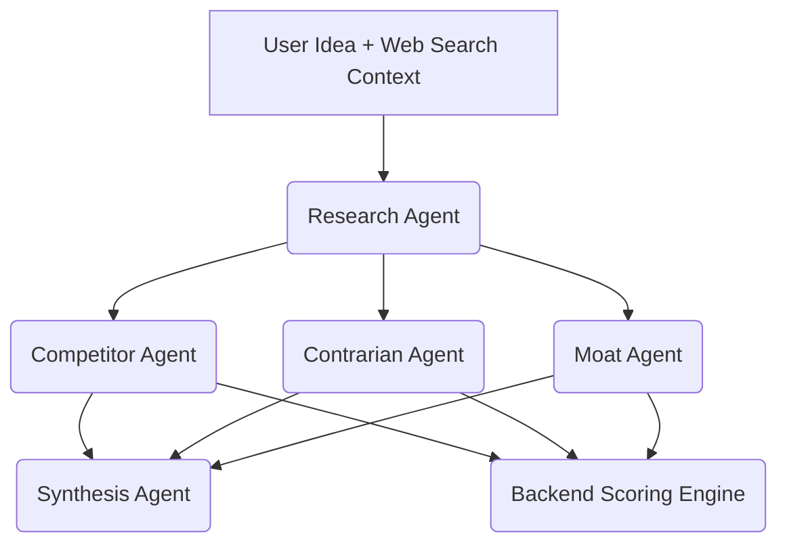

# Pivotly V2 Prompt Flow

## Overview
In V1, a single monolithic prompt was dispatched to Gemini. In V2, we implement a Directed Acyclic Graph (DAG) prompt flow. This reduces context bloat, improves the LLM's adherence to structured output schemas, and allows specific agent personas to operate independently.

## Flow Diagram

## Agent Prompts

### 1. Research Agent
**Persona:** Objective Market Data Researcher
**Input:** Idea Text, Region, Budget, Raw Tavily Search Results
**Goal:** Extract pure factual data. Do not generate opinions.
**Prompt Concept:**
> "You are an objective market researcher. Read the provided search results and startup idea. Extract the market size, growth rate, and target audience. Identify mentioned competitors. If a number or fact is stated, you MUST provide the exact Source URL and quote in the evidence_list. Do not evaluate if the idea is good or bad."
**Output Schema:** `ResearchContext`

### 2. Competitor Agent
**Persona:** Cutthroat Competitive Intelligence Analyst
**Input:** Idea Text, `ResearchContext` (Output from Agent 1)
**Goal:** Determine how competitors will destroy the startup.
**Prompt Concept:**
> "You are a competitive intelligence analyst. Review the startup idea and the list of competitors from the Research Context. For each competitor, define their threat level and explicitly explain their `copy_risk` (how easily they could copy the user's idea). Determine the market concentration."
**Output Schema:** `CompetitorAnalysis`

### 3. Contrarian Agent
**Persona:** Skeptical Sequoia Capital Partner
**Input:** Idea Text, `ResearchContext` (Output from Agent 1)
**Goal:** Find reasons to say "No" to the investment.
**Prompt Concept:**
> "You are a skeptical Tier-1 Venture Capitalist. Your job is to reject this startup. Review the idea and the factual market context. List the top 5 reasons this startup will fail. Identify the critical assumptions the founder is making that are likely false. Be ruthless but grounded in reality."
**Output Schema:** `ContrarianAnalysis`

### 4. Moat Agent
**Persona:** Strategic Defensibility Expert
**Input:** Idea Text, `ResearchContext`, `CompetitorAnalysis`
**Goal:** Identify any defensible moats.
**Prompt Concept:**
> "You are a startup strategist analyzing defensibility. Based on the idea and the competitor landscape, determine if this startup has a true moat (Network Effects, Data Advantage, Switching Costs, etc.). Determine how difficult it is for a well-funded competitor to clone this product."
**Output Schema:** `MoatAnalysis`

### 5. Synthesis Agent (Final Report Assembly)
**Persona:** Executive Summary Writer
**Input:** Idea Text, outputs from ALL previous agents.
**Goal:** Replace the generic SWOT with high-level strategic takeaways.
**Prompt Concept:**
> "You are a Chief of Staff writing an executive brief. Review the market data, competitor threats, contrarian risks, and moat analysis. Synthesize this into four precise sections: 1) Why This Could Win, 2) Why This Could Fail, 3) What Must Be True (for success), 4) Biggest Unknowns. Finally, provide a 2-sentence Executive Summary and a Final Recommendation (Build/Pivot/Avoid)."
**Output Schema:** `StrategicSynthesis` (Mapped into final `VentureReportV2`)

## Token Optimization Strategy
- By passing only the `ResearchContext` (a structured, concise JSON) to the downstream agents instead of the massive Raw Tavily Search text, we cut input tokens for Agents 2, 3, and 4 by over 80%.
- Because agents output smaller, specific JSON objects, the chance of `google-genai` throwing a Pydantic Validation error drops significantly.
