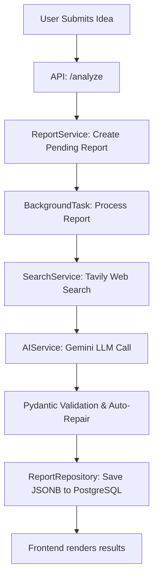

# Pivotly V2 Architecture Audit

## 1. Current System Flow
The current system architecture operates as a linear, single-shot pipeline. 

## 2. Current Prompt Flow
Currently, Pivotly relies on a **single giant prompt** (`prompt_builder.py`) sent to `Gemini 1.5 Flash` (or Pro). 
- It concatenates the idea, region, budget, and raw Tavily search results.
- It asks the LLM to simultaneously identify the industry, list competitors, estimate market size, generate a SWOT, write a Go-to-Market strategy, and provide a final verdict.
- It relies entirely on Gemini's native structured outputs (`response_schema=VentureReport`) to return a massive JSON payload.

## 3. Current Scoring Flow
The current `ScoringRubric` is entirely hallucinated by the LLM. 
- The prompt asks Gemini to provide `market_size_score`, `competitive_advantage_score`, `technical_feasibility_score`, `monetization_potential_score`, and `founder_fit_score` (1-10) along with an `overall_score` out of 100.
- Because it is generated in a single pass without a rigid deterministic rubric, the scores are often arbitrary, inconsistent between runs, and disconnected from the qualitative evidence provided in other sections.

## 4. Current Weaknesses
1. **Hallucinated Scores & Confidence:** The LLM invents quantitative metrics. Asking an LLM for "confidence: 85%" provides zero mathematical validity.
2. **Repetitive Content:** The SWOT analysis, Investor Verdict, and Failure Risks often repeat the exact same points in slightly different wording. 
3. **Context Truncation:** Feeding raw search results into one giant prompt dilutes the LLM's attention.
4. **Validation Brittleness:** A single giant JSON response from Gemini is highly prone to validation failures (e.g., hallucinated keys, missing arrays, type mismatches), requiring aggressive auto-repair scripts.
5. **Lack of True Evidence:** The system asks for evidence, but frequently accepts generic statements rather than enforcing hard citations (Source URLs).
6. **Shallow Competitor Analysis:** Competitors are simply listed. The system does not analyze *how* or *why* the competitor would defeat the user.

## 5. Token Usage Estimates
- **Input:** ~2,000 to 5,000 tokens (Idea + large raw text dump from Tavily API).
- **Output:** ~1,500 to 3,000 tokens (Giant JSON).
- **Total:** ~3,500 to 8,000 tokens per report.
- *Issue:* While well within Gemini's context window, forcing a single generation to cover 12 different analytical modalities guarantees shallow reasoning. 

## 6. Low Value Sections
- **SWOT Analysis:** Highly generic. "Strength: Innovative idea" or "Weakness: Lack of funding" is generated for almost every startup.
- **Unit Economics:** The LLM cannot accurately guess LTV/CAC for an unlaunched idea without user metrics. It produces generic jargon.
- **Investor Verdict (Would Invest boolean):** Meaningless without deep financial modeling. 

## 7. Recommended Architecture Changes
1. **Multi-Agent Pipeline:** Break the single LLM call into distinct, focused tasks (Research, Competitors, Contrarian, Moat).
2. **Deterministic Scoring:** Move the math out of the LLM and into Python backend logic.
3. **Rigid Evidence Constraints:** Create an `Evidence` schema that enforces a citation for every major claim. 
4. **Pipeline Orchestration:** Use an async DAG (Directed Acyclic Graph) approach to run independent LLM agents concurrently (e.g., Competitor analysis and Contrarian analysis can run at the same time once the base Research is done).
